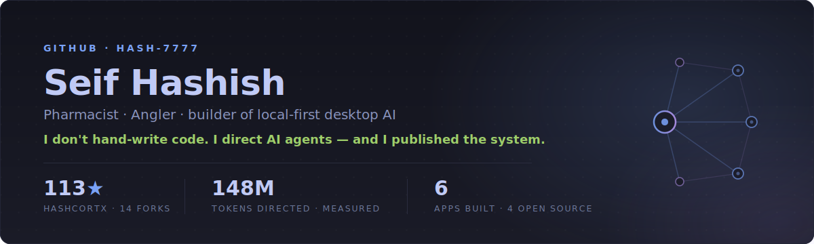

 

**From prescriptions to pull requests** — a self-taught builder with no CS degree and no team, obsessed with **local-first desktop AI**: private, fast, honest apps that run entirely on your machine and send nothing to the cloud.

  
  
  
  
  

---

## ◦ How I work

I'm a **power user of AI coding agents**, and I treat it as a discipline rather than a shortcut.

**148 million measured tokens** of real work sit behind the apps below — 35M on HashCortX alone. That number is measured rather than guessed, because I built and released the meter that counts it. The agents write; I direct, review and verify. Every product decision, every architecture call and every security model in these apps is mine.

The method is written down and open-sourced as **[Hash AI Coding Persona](https://github.com/Hash-7777/Hash-AI-Coding-persona)** — persistent memory, git work-trees, signed-commit discipline, and verify-before-you-trust. It's how you move at agent speed without the mess.

I don't reach for orchestration frameworks. Everything below — the swarms, the planners, the tool registries, the retrieval — I designed and had built from first principles.

---

## ◦ What I'm building

<table>
<tr>
<td width="50%" valign="top">

### [HashCortX](https://github.com/Hash-7777/HashCortX)
The local-first AI workspace for macOS. **Ten workspaces** — Coder, Agent Swarm, Finance, 3D Forge, Sandbox, Virtual OS and more. **12 providers**, or fully offline with Ollama. Nine specialist agents, real CPython in a sandbox. No backend, no telemetry, no account. 8.9 MB.

`Tauri` · `Rust` · `JS`

</td>
<td width="50%" valign="top">

### [HashMeterAi](https://github.com/Hash-7777/HashMeterAi)
The honest, local-first usage meter for AI coding tools. Counts **real measured tokens**, not estimates — across six tools. No server, and it never reads your chats. It's the meter behind the 148M above.

`Tauri` · `Rust`

</td>
</tr>
<tr>
<td valign="top">

### [Hash AI Coding Persona](https://github.com/Hash-7777/Hash-AI-Coding-persona)
The written-down system for shipping serious software with AI coding agents — persistent memory, git work-trees, signed commits, verify-before-you-trust. Copy-paste templates. Works with any agent, any model, including local Ollama.

`Markdown` · `any agent` · `any model`

</td>
<td valign="top">

### [Hash Medical Research Agent Skills](https://github.com/Hash-7777/Hash-Medical-Reasearch-Agent-Skills)
Drop-in agent skills that make an AI appraise medical literature like a reviewer — grade every citation against its source, run reproducible PRISMA searches, pool studies safely, and defend RAG against prompt injection.

`Markdown` · `framework-agnostic`

</td>
</tr>
<tr>
<td valign="top">

### HashCerebrum
A local-first medical-research workbench — a 3D anatomical brain that searches, cites and peer-reviews the literature. A query planner decomposes the question, specialist agents collaborate over a shared blackboard, and **every claim is graded against the evidence it cites** before you see it.

`Tauri` · `React` · `Three.js`

</td>
<td valign="top">

### Barracudask
A living fishing atlas on a 3D globe, with an AI fish specialist that flies the earth to show migrations and catch spots — an agent driving a real interface through tool calls, not returning text. (The *angler* in me, in code.)

`Tauri` · `Rust` · `globe.gl`

</td>
</tr>
</table>

---

## ◦ What my apps are built with

---

Local-first by conviction — private, fast, honest software that runs on <b>your</b> machine.

